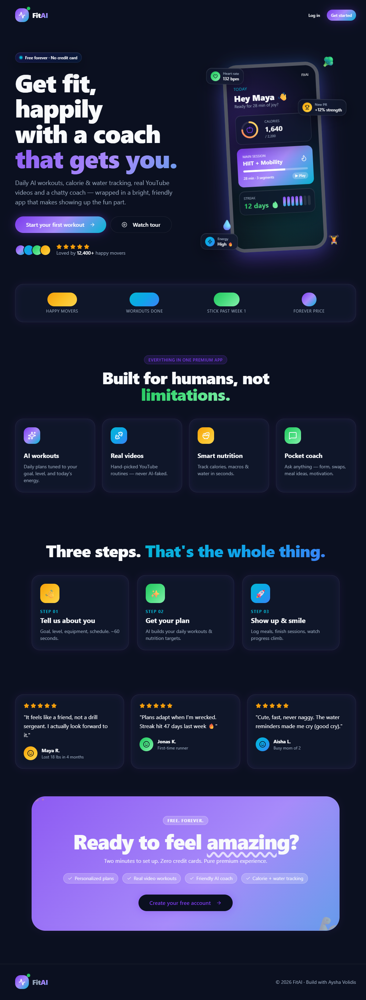
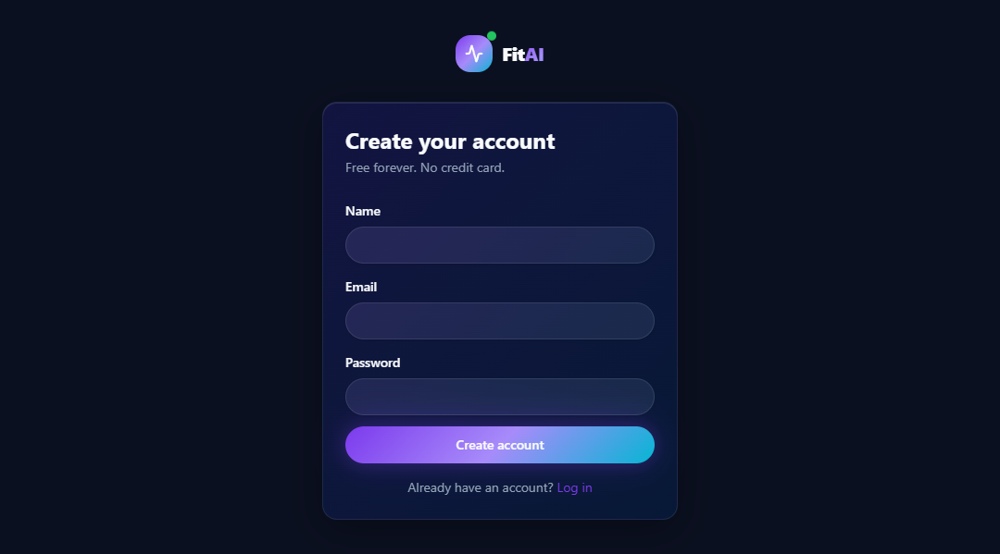
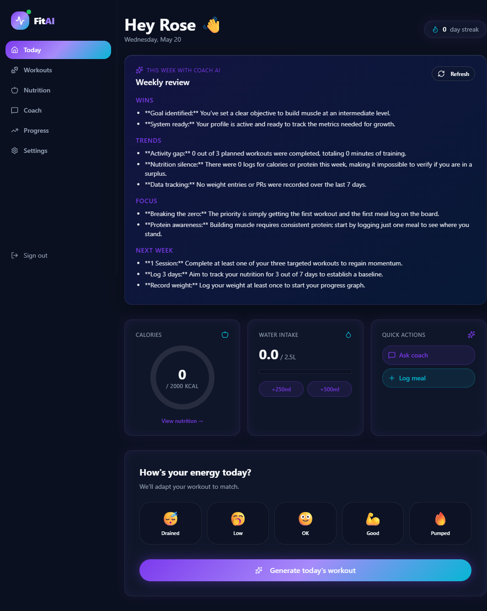
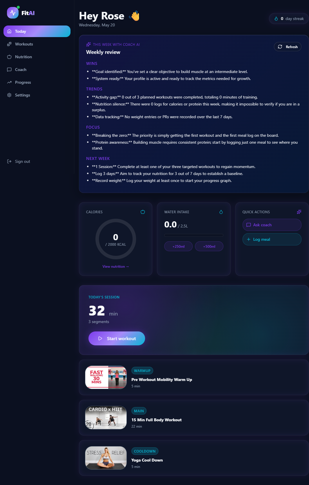
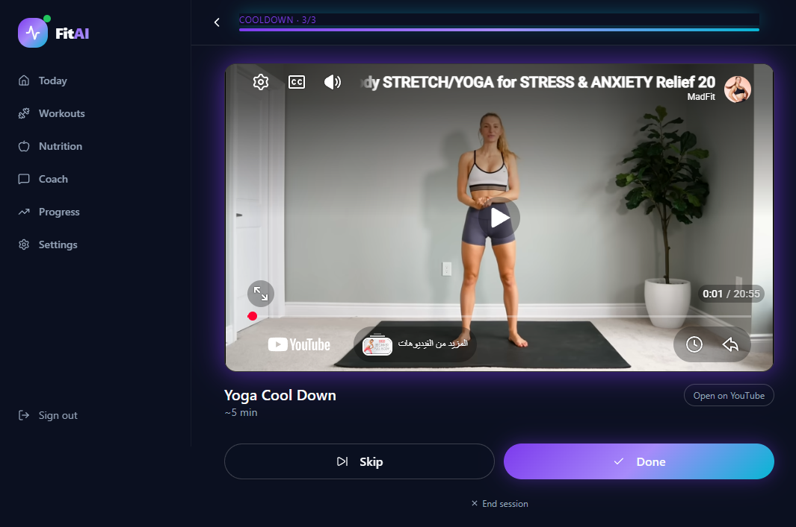
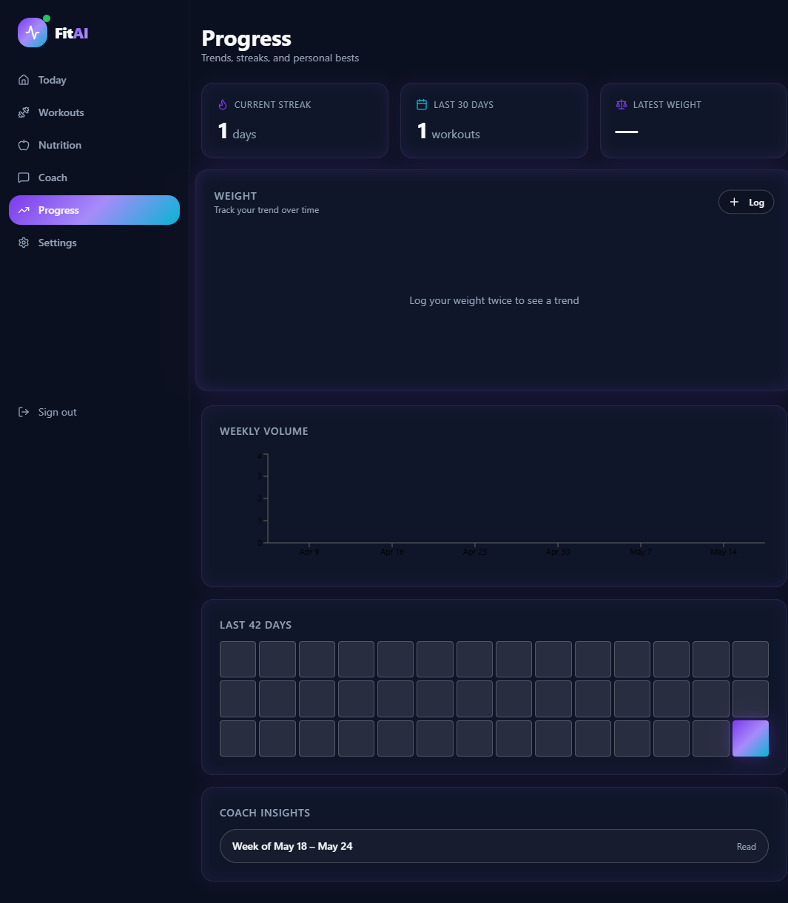
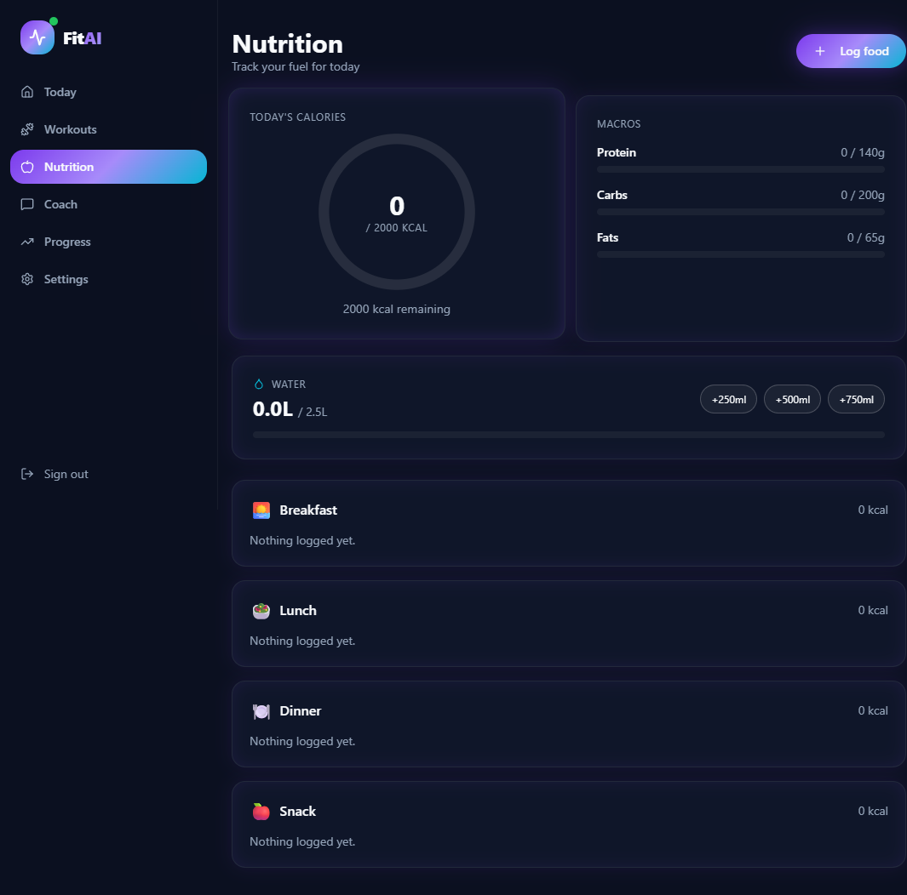
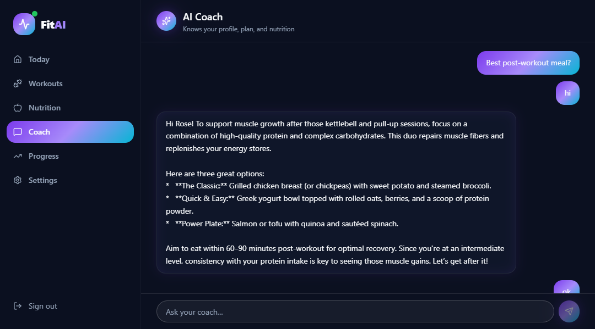
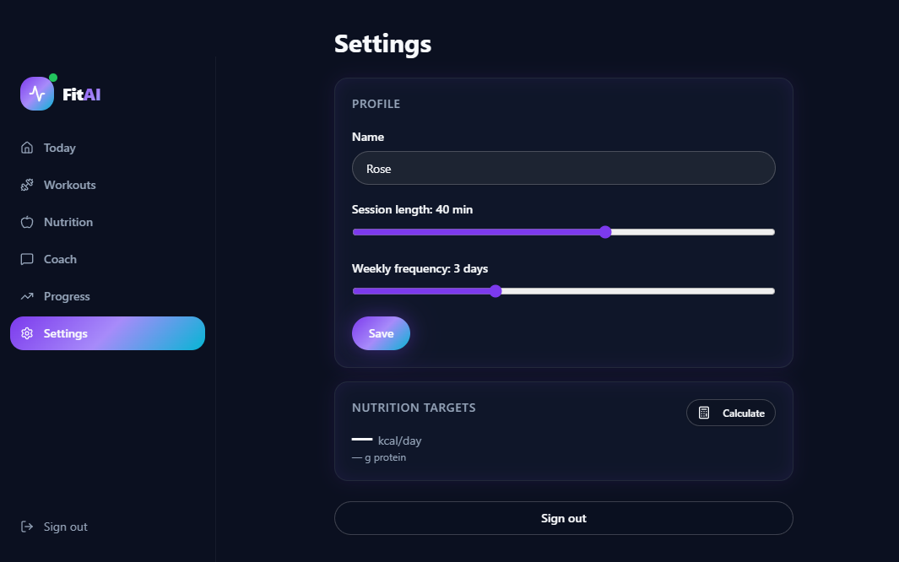

# FitAI 🏋️‍♀️✨

**Your bright, friendly AI fitness coach — totally free.**

FitAI is a full-stack web application that delivers personalized daily workouts, nutrition tracking, and an AI-powered coach, all wrapped in a vibrant, playful interface designed to make fitness feel fun and approachable.










---

## 🎯 Features

### 🤖 AI-Powered Workouts
- Daily workout plans generated by **Gemini AI**, tailored to your goal, fitness level, available equipment, and energy level.
- Three-phase sessions: **Warm-up → Main Session → Cool-down**, built from real YouTube exercise videos.
- Adaptive difficulty that evolves based on your feedback and history.

### 🥗 Nutrition Tracking
- Log meals by type (breakfast, lunch, dinner, snack) with calories, protein, carbs, and fats.
- Daily calorie and macro targets with visual progress rings.
- Water intake tracking with quick-add buttons.
- AI-powered macro target suggestions based on your fitness goal.

### 💬 AI Coach Chat
- Conversational AI coach powered by **Gemini** that knows your profile, recent workouts, nutrition logs, and weight history.
- Ask anything — form tips, exercise swaps, meal ideas, or motivation.
- Full chat history with persistent message storage.

### 📊 Progress Dashboard
- Workout streak tracking with visual heatmap calendar.
- Weight trend charts over time.
- Weekly AI-generated insights analyzing your workout consistency, nutrition habits, and personal records.
- Completion rates and personal record tracking.

### 🏠 Daily Dashboard
- Personalized greeting with today's workout at a glance.
- Calorie ring showing daily intake vs. target.
- Water tracker with quick-add buttons.
- Current streak counter.

### ⚙️ Settings
- Edit your name, workout duration preference, and weekly frequency.
- Clean, simple profile management.

### 🎬 Workout Player
- Embedded YouTube video player for guided workout sessions.
- Segment-by-segment progress tracking.
- Skip, complete, or rate each exercise segment.
- Post-workout rating and difficulty feedback.

---

## 🛠️ Tech Stack

| Layer           | Technology                                                                 |
|-----------------|----------------------------------------------------------------------------|
| **Framework**   | [TanStack Start](https://tanstack.com/start) (React 19 + SSR)             |
| **Routing**     | [TanStack Router](https://tanstack.com/router) (file-based routing)        |
| **Styling**     | [Tailwind CSS v4](https://tailwindcss.com/) + custom design system         |
| **Animations**  | [Framer Motion](https://www.framer.com/motion/)                            |
| **UI Library**  | [Radix UI](https://www.radix-ui.com/) primitives + [shadcn/ui](https://ui.shadcn.com/) components |
| **Charts**      | [Recharts](https://recharts.org/)                                          |
| **Database**    | [Supabase](https://supabase.com/) (PostgreSQL + Auth + RLS)                |
| **AI**          | [Google Gemini API](https://ai.google.dev/) (`gemini-flash`)               |
| **Build Tool**  | [Vite 7](https://vite.dev/)                                               |
| **Deployment**  | Cloudflare Workers (via `@cloudflare/vite-plugin`)                         |

---

## 📁 Project Structure

```
src/
├── components/          # Reusable UI components (Logo, CalorieRing, shadcn/ui)
├── hooks/               # Custom React hooks (useAuth, useMobile)
├── integrations/
│   └── supabase/        # Supabase client, server client, auth middleware, types
├── lib/                 # Business logic & AI
│   ├── ai.ts            # Gemini API integration
│   ├── generatePlan.functions.ts   # AI workout plan generation
│   ├── insights.functions.ts       # Weekly AI insight generation
│   └── nutrition.functions.ts      # Nutrition CRUD & AI macro suggestions
├── routes/
│   ├── index.tsx         # Landing page
│   ├── login.tsx         # Login page
│   ├── signup.tsx        # Signup page
│   ├── _authenticated.tsx           # Auth layout with sidebar & bottom nav
│   ├── _authenticated/
│   │   ├── dashboard.tsx  # Daily dashboard
│   │   ├── workouts.tsx   # Workout generation
│   │   ├── nutrition.tsx  # Nutrition tracking
│   │   ├── chat.tsx       # AI coach chat
│   │   ├── progress.tsx   # Progress & insights
│   │   ├── settings.tsx   # Profile settings
│   │   ├── player.tsx     # Workout video player
│   │   ├── complete.tsx   # Post-workout feedback
│   │   └── onboarding.tsx # New user onboarding flow
│   └── api/
│       ├── chat.ts        # Server-side AI chat endpoint
│       └── public/hooks/  # Webhook for weekly insight generation
└── styles.css            # Global styles & design tokens
```

---

## 🚀 Getting Started

### Prerequisites
- **Node.js** 18+ and **npm**
- A [Supabase](https://supabase.com/) project with the required tables (see `src/integrations/supabase/types.ts` for the full schema)
- A [Google Gemini API key](https://ai.google.dev/)

### Installation

```bash
# Clone the repository
git clone https://github.com/AyshaVolidis/FitAI.git
cd FitAI

# Install dependencies
npm install
```

### Environment Variables

Create a `.env` file in the root directory:

```env
# Supabase
SUPABASE_URL="https://your-project.supabase.co"
SUPABASE_PUBLISHABLE_KEY="your-anon-key"
VITE_SUPABASE_URL="https://your-project.supabase.co"
VITE_SUPABASE_PUBLISHABLE_KEY="your-anon-key"

# Gemini AI
GEMINI_API_KEY="your-gemini-api-key"
```

### Run Locally

```bash
npm run dev
```

The app will be available at **http://localhost:3000**.

### Build for Production

```bash
npm run build
npm run preview
```

---

## 📱 Pages Overview

| Route              | Description                                      |
|--------------------|--------------------------------------------------|
| `/`                | Landing page with hero, features, testimonials   |
| `/login`           | Email/password login                             |
| `/signup`          | Account creation                                 |
| `/onboarding`     | New user setup (goal, level, equipment, schedule) |
| `/dashboard`       | Daily overview with workout, calories, water      |
| `/workouts`        | Generate a new AI workout plan                   |
| `/player`          | Video workout player with segment tracking       |
| `/complete`        | Post-workout rating & feedback                   |
| `/nutrition`       | Meal logging, water tracking, macro targets      |
| `/chat`            | AI coach conversation                            |
| `/progress`        | Streak calendar, weight chart, weekly insights   |
| `/settings`        | Profile & preference management                  |

---

## 🗄️ Database Schema

The Supabase database includes the following tables:

- **profiles** — User profiles with fitness goals, levels, and nutrition targets
- **workout_sessions** — Generated workout plans and completion status
- **segment_feedback** — Per-exercise feedback during workouts
- **food_logs** — Meal entries with calories and macros
- **water_logs** — Daily water intake records
- **weight_logs** — Weight tracking over time
- **chat_messages** — AI coach conversation history
- **weekly_insights** — AI-generated weekly progress reports
- **personal_records** — Exercise personal bests
- **seed_videos** — YouTube exercise video library

---

## 🔮 Upcoming Features

The following features are planned for future releases:

- [ ] **Continue with Google** — OAuth sign-in via Google for faster account creation and login
- [ ] **Social sharing** — Share workout streaks and achievements with friends
- [ ] **Push notifications** — Daily workout reminders and streak alerts
- [ ] **Dark/Light mode toggle** — Manual theme switching
- [ ] **Export data** — Download workout and nutrition history as CSV
- [ ] **Multi-language support** — Arabic, French, and more

---

## 👩‍💻 Author

**Aysha Volidis**


